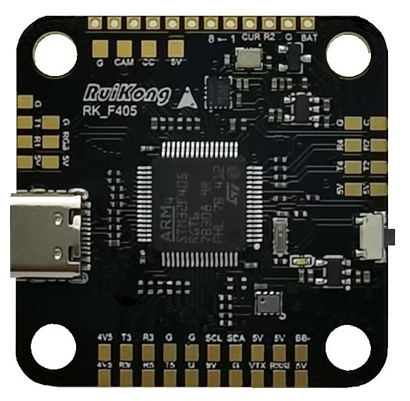
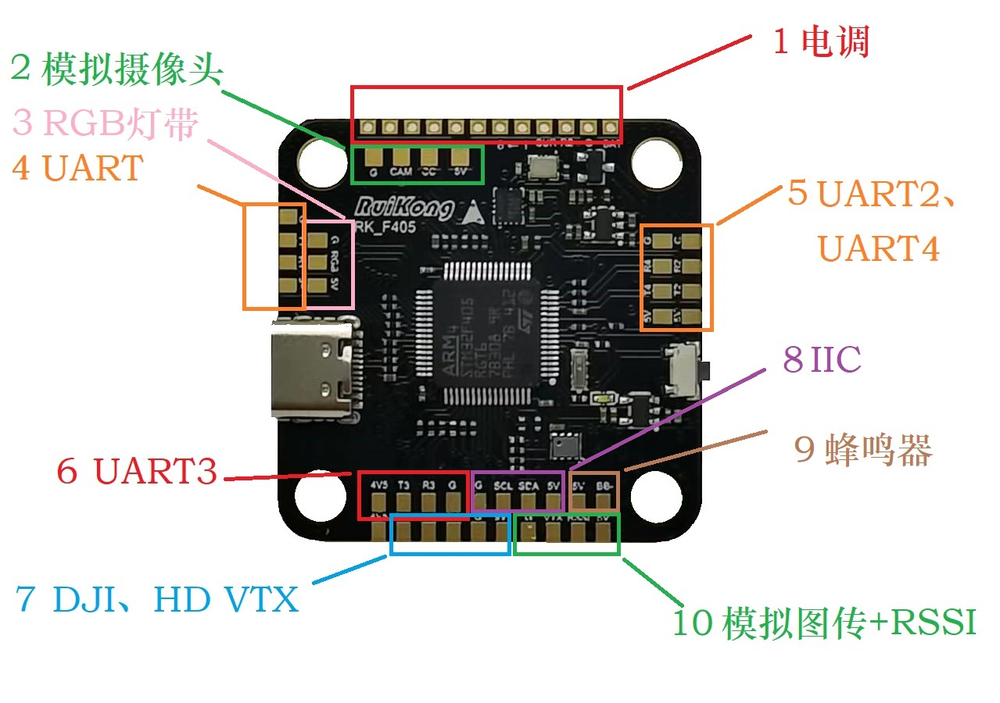

# 瑞控RKF405飞控固件仓库  

## 介绍  
这是扬州瑞控汽车电子有限公司RKF405对BetaFlight以及INAV两种固件所用的软件仓库；  
**根据BetaFlight和INAV的开源协议**，将需要替换的驱动代码以及端口配置开源上传；  
   

## 配置
| 功能 | 信息介绍 | 
|-------|-------|
| BEC | 9V3A/5V3A |
| 主控 | STM32F405VG |
| 陀螺仪 | ICM42688(外接时钟) |
| 气压计 | DPS368 |
| OSD | ATE7456E |
| FLASH | 16MB |

## 目前固件支持状态  
| 软件| 低噪声适配 | 版本 |更新日期 |
|-------|-------|-------|-------|
|**BetaFlight**| 是| 4.5.2 |25/4/25 |
| **INAV** | 暂无 |8.0.1|25/4/7|

## 接线图
  

